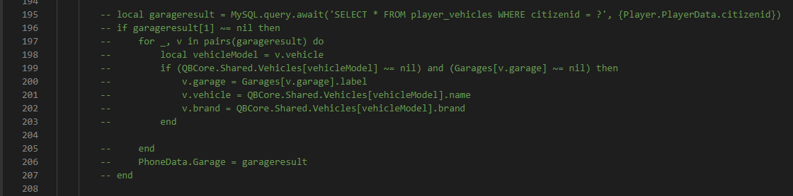

# qb-phone

To fix the integrated qb-phone after removing qb-garages, and to see your owned vehicles on the garages app within the phone, you need to make two modifications to the qb-phone source code.

### Go to file `qb-phone/client/main.lua`

On **line 302** replace`qb-garage:server:GetPlayerVehicles` with `jg-advancedgarages:server:GetVehiclesPhone` (or you could do a find and replace in your text editor!), like in the screenshot below:

<figure><figcaption></figcaption></figure>

### Go to file `qb-phone/server/main.lua`

Comment out lines **229 - 241** like in the screenshot below:

<figure><figcaption></figcaption></figure>
