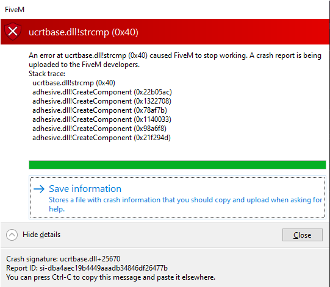

# ucrtbase.dll!strcmp crash

A common issue is when opening a garage, your game will crash and produce the following error:

<figure><figcaption></figcaption></figure>

This is because of a call for a FiveM native that is only available in newer versions of GTA 5. To fix this, add the following line anywhere inside of your `server.cfg`

```
sv_enforcegamebuild 2944
```
