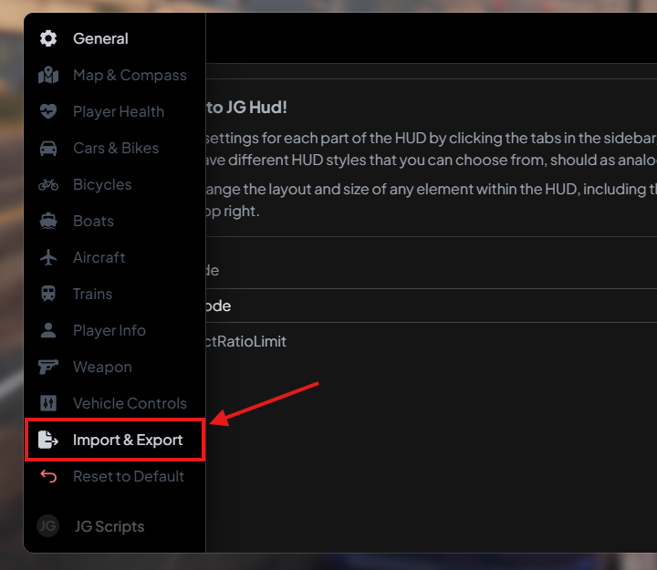

# Manual Transmissions & Smooth First Gear


Requires **game build 3095** or newer. You can enforce this on your server by adding `sv_enforceGameBuild 3095` to your server.cfg.



Available in Mechanic v1.5 and newer. These settings will have no effect/not appear on electric vehicles.


### Setup

This functionality relies on some new-ish game functionality, via `strAdvancedFlags` in a vehicle's handling.meta. In order for everything to work as expected, we need to make sure this property is at least present in the file.

#### Base Game Vehicles

Most base game vehicles already have it present, but annoyingly, many also have it missing. To fix this, you need to re-stream the handling.meta for all base game vehicles. Sounds complicated, but I made a resource for it, so just drag and drop and then continue with this guide.



#### Addon Vehicles

If you're trying to get this to work with an addon vehicle, you will unfortunately have to mess with some code. Head into the vehicle's files, and locale the **handling.meta**. Within there, you will be looking to add:

```xml
<strAdvancedFlags>0</strAdvancedFlags>
```

to the section `CCarHandlingData`. Just like this:

<figure><figcaption></figcaption></figure>

If the section `<Item type="CCarHandlingData">`isn't present, then you will have to add it yourself.

### Manual Transmission

You can now add a _real_ manual transmission, in the tablet's tuning parts menu. This is a special item that will change the vehicle's strAdvancedFlags to prevent automatic shifting and require the player to do it themselves. If gear shifting is performed badly, the engine will take damage. The experience is fairly realistic, without being too difficult to use for the average player. The car will not move if you try to move it in 4th gear, for example.

To make it as easy as possible to use & actually desirable on your server, we detect if a vehicle has been stuck at a gear at high RPM for an extended time, and show a prompt with the key bindings to upshift/downshift.

Please note that this functionality is only available in **game build 3095 or newer**. It's super simple to enforce a game build on your server; simply add `sv_enforceGameBuild 3095` to your server.cfg.

See it in action here:



### Changing Key Binds

This is done in-game. Hit `ESC`to go into the pause menu, then head to Settings > Key Binds > GTA Online Vehicles & adjust the "Shift Gear Up"/"Shift Gear Down" binds.

### Smooth First Gear

This is a global config option, that will apply server-wide to all vehicles, including vehicles just spawned in/not owned. It will also update the vehicle's strAdvancedFlags to slow the RPM curve of the first gear to a rate much more realistic. This allows a console-type effect on keyboard, with reduced wheelspin and more time to upshift without being in redline when using a manual transmission.

You can enable it by setting:

```lua
Config.SmoothFirstGear = true
```
